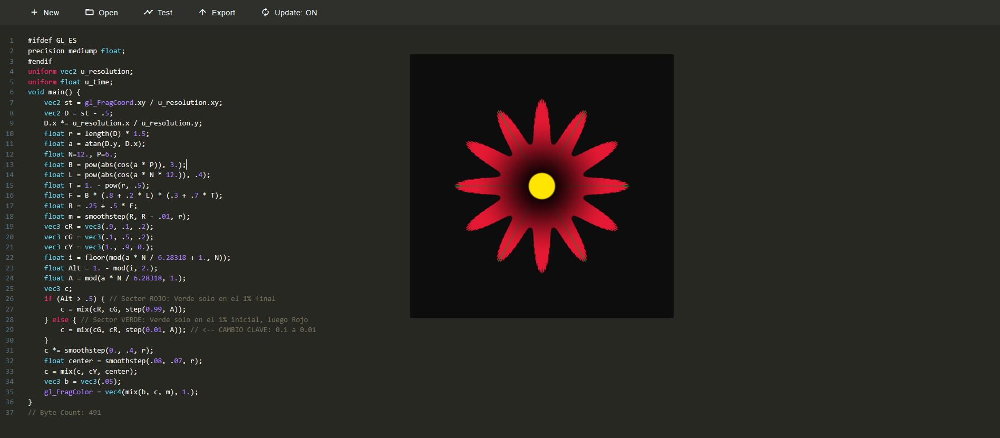

# Shaders

En este proyecto se basa en desarrollar shaders para una prática anterior hecha donde,en mi caso,escogi la de visualización de datos donde hize un shader para resaltar el relieve y la luz y 
en la segunda parte nos pedian realizar un fragment shader con patrón generativo lo cual escogi hacer una pascua navideña.

La idea de hacer el primero fue la gran necesidad de hacer que el planeta en mi visualización de los datos de la migración de las aves se viera más atractivo;en cuanto a la pascua navideña
me motivo la cercanía de la navidad.

Una vez explicado esto se comenzará a explicar los fragmentos relacionados con los shaders añadidos en la visualización de los datos de migración de aves.
Primero se ha descargado un pack de texturas primero la del planeta,luego la textura del relieve y la textura especular.En segundo lugar se carga estas texturas
en las siguientes variables ayudada de un cargadador de texturas también inicializado.

<br>

```javascript
const textureLoader = new THREE.TextureLoader();

// 2. Carga las texturas del planeta
const colorMap = textureLoader.load("mapadia.jpg");
const normalMap = textureLoader.load("normal.png");
const specularMap = textureLoader.load("specular.png");
```
En tercer lugar se activa la repetición de la textura especular en ambas direcciones y luego se marca la textura como modificada para que Three.js aplique los cambios.
<br>

```javascript
specularMap.wrapS = specularMap.wrapT = THREE.RepeatWrapping;
specularMap.needsUpdate = true;
```
En cuarto lugar se ajusta la luz para el shader. La dirección de la luz debe ser un vector normalizado.
```javascript
const lightPosition = new THREE.Vector3(100, 50, 150); // Posición de luz alejada
const lightDirection = lightPosition.clone().normalize();
const lightIntensity = 1.5; // Intensidad alta
```
En quinto lugar se declara la variable uniforms donde está definiendo y agrupando todas las variables que se van a pasar desde tu código JavaScript (CPU) al programa de sombreado (Shader) que se ejecutará en la tarjeta gráfica (GPU).
```javascript
const uniforms = {
  // Texturas
  u_map: { value: colorMap },
  u_normalMap: { value: normalMap },
  u_roughnessMap: { value: specularMap }, // Usado como Roughness/Specular

  // Parámetros de la Tierra/Shader
  u_normalScale: { value: new THREE.Vector2(20.0, 20.0) }, // Intensidad del relieve
  u_lightDirection: { value: lightDirection },
  u_lightColor: { value: new THREE.Color(0xffffff) },
  u_lightIntensity: { value: lightIntensity },
};

````
En sexto lugar declaramos el vertex shader pasandole la UV,la normal y la posicion para el fragment shader
```javascript
const vertexShaderCode = `
    varying vec2 vUv;
    varying vec3 vNormal; 
    
    void main() {
        vUv = uv;
        vNormal = normalize(normalMatrix * normal); // Transforma la normal al espacio de la vista
        
        vec4 mvPosition = modelViewMatrix * vec4(position, 1.0);
        gl_Position = projectionMatrix * mvPosition;
    }
`;
```
En séptimo lugar  declaramos el fragment shader donde se calcula la iluminación usando Normal Mapping y Roughness
```javascript
const fragmentShaderCode = `
    uniform sampler2D u_map;
    uniform sampler2D u_normalMap;
    uniform sampler2D u_roughnessMap;

    uniform vec2 u_normalScale;
    uniform vec3 u_lightDirection;
    uniform vec3 u_lightColor;
    uniform float u_lightIntensity;

    varying vec2 vUv;
    varying vec3 vNormal;

    // Función que perturba la normal (Normal Mapping simplificado)
    vec3 perturbNormal(vec3 N) {
        vec3 mapN = texture2D(u_normalMap, vUv).xyz * 2.0 - 1.0;
        mapN.xy *= u_normalScale;
        return normalize(N + mapN); 
    }

    void main() {
        // 1. Obtener color base de la textura
        vec4 color = texture2D(u_map, vUv);
        
        // 2. Obtener la rugosidad (usada aquí para diferenciar tierra/agua)
        float roughness = texture2D(u_roughnessMap, vUv).g;

        // 3. Calcular la normal perturbada por el Normal Map
        vec3 perturbedNormal = perturbNormal(vNormal);

        // 4. Modelo de Iluminación: Lambertiano (Difuso)
        float NdotL = max(dot(perturbedNormal, u_lightDirection), 0.0);
        
        // 5. Calcular el color difuso (luz * factor de incidencia * color de la textura)
        vec3 diffuse = NdotL * u_lightColor * u_lightIntensity;
        
        // 6. Oscurecer ligeramente el océano (simulación de reflexión/no difusa)
        if (roughness < 0.2) { 
            diffuse *= 0.7; 
        }
        
        // 7. Color Final
        gl_FragColor = vec4(color.rgb * diffuse, 1.0);
    }
`;
```
Por último se declara el shaderMaterial y se le añade a la tierra 
```javascript
// Crear el ShaderMaterial
const shaderMaterial = new THREE.ShaderMaterial({
  uniforms: uniforms,
  vertexShader: vertexShaderCode,
  fragmentShader: fragmentShaderCode,
  lights: false,
});
```

https://github.com/user-attachments/assets/e6773a17-36e3-46d1-8199-f17902d38c31


Aquí está la explicación paso a paso de lo que hace cada sección de la pascua creada en GLSL con patron generativo:

-----

##  1. Configuración Inicial y Variables Uniform

```glsl
#ifdef GL_ES
precision mediump float;
#endif
uniform vec2 u_resolution;
uniform float u_time;
```

  * **`#ifdef GL_ES...`**: Esto es estándar. Asegura que la precisión de los números flotantes sea media (`mediump float`), lo cual es común en WebGL y dispositivos móviles para optimizar el rendimiento.
  * **`uniform`**: Estas variables son constantes para todos los píxeles durante un *frame*.
      * **`u_resolution`**: El tamaño (ancho y alto) de la pantalla o área de dibujo.
      * **`u_time`**: El tiempo transcurrido desde el inicio. (Aunque está declarado, **no se usa** en este código, lo que significa que el patrón es estático).

-----

##  2. Normalización de Coordenadas y Vector Dirección

```glsl
vec2 st = gl_FragCoord.xy / u_resolution.xy;
vec2 D = st - .5;
D.x *= u_resolution.x / u_resolution.y;
float r = length(D) * 1.5;
float a = atan(D.y, D.x);
```

1.  **`st` (Coordenadas Normalizadas)**: Toma las coordenadas del píxel actual (`gl_FragCoord.xy`) y las divide por la resolución. Esto mapea la pantalla al rango $[0, 1]$ (horizontal y vertical).
2.  **`D` (Desplazamiento al Centro)**: Mueve el origen de las coordenadas al centro de la pantalla restando `0.5`. El centro ahora es $(0, 0)$.
3.  **Corrección de Aspecto**: Multiplica la componente $x$ de $D$ por el ratio de aspecto. Esto asegura que un círculo se vea como un círculo, incluso si el área de dibujo no es cuadrada.
4.  **`r` (Radio/Distancia)**: Calcula la **distancia** (magnitud) del píxel actual al centro. Se multiplica por $1.5$ para "acercar" el patrón, haciéndolo crecer más rápido.
5.  **`a` (Ángulo)**: Calcula el **ángulo** del píxel respecto al centro usando la función `atan(y, x)`. Esto nos da el ángulo en radianes, generalmente en el rango $[-\pi, \pi]$.

-----

##  3. Creación del Patrón Radial (La "Flor")

Esta sección define las formas y los detalles del patrón.

```glsl
float N=12., P=6.;
float B = pow(abs(cos(a * P)), 3.);
float L = pow(abs(cos(a * N * 12.)), .4);
float T = 1. - pow(r, .5);
float F = B * (.8 + .2 * L) * (.3 + .7 * T);
float R = .25 + .5 * F;
float m = smoothstep(R, R - .01, r);
```

  * **`N` y `P`**: Constantes que definen la frecuencia de los patrones.
      * $P=6$ controla el patrón principal de los pétalos. $P=6$ resulta en 12 picos (debido al `abs(cos(...))`).
      * $N=12$ se usa para el detalle fino (`L`).
  * **`B` (Forma Base)**: Una forma de **pétalo** o lóbulo controlada por el coseno del ángulo. El `pow(..., 3.)` afila los picos.
  * **`L` (Detalle Fino/Ruido)**: Introduce un detalle muy fino y de alta frecuencia (144 picos) a lo largo del ángulo.
  * **`T` (Degradado Radial)**: Crea un valor que es $1$ en el centro y disminuye hacia los bordes.
  * **`F` (Forma Final)**: Combina los tres elementos anteriores:
      * `B` (Pétalo) es la base.
      * `L` modula el brillo (`.8 + .2 * L`) para añadir el detalle fino.
      * `T` modula el brillo (`.3 + .7 * T`) para hacerlo más brillante en el centro.
  * **`R` (Radio de Corte)**: Calcula el radio variable de la forma. El radio base es `0.25`, y se añade una variación controlada por `F`. Este es el borde de la forma "floreada".
  * **`m` (Máscara)**: Esta es la **máscara binaria** del patrón. Usa `smoothstep` para crear un borde suave:
      * Devuelve $1$ (adentro) cuando la distancia `r` es menor que el radio de corte `R`.
      * Devuelve $0$ (afuera) cuando la distancia `r` es mayor que $R - 0.01$.
      * Entre $R$ y $R - 0.01$, crea un *antialiasing* o desenfoque suave del borde.

-----

##  4. Definición de Colores y Alternancia Angular

```glsl
vec3 cR = vec3(.9, .1, .2);
vec3 cG = vec3(.1, .5, .2);
vec3 cY = vec3(1., .9, 0.);
float i = floor(mod(a * N / 6.28318 + 1., N));
float Alt = 1. - mod(i, 2.);
float A = mod(a * N / 6.28318, 1.);
vec3 c;
```

1.  **Definición de Colores**:
      * `cR`: Rojo oscuro/carmín.
      * `cG`: Verde oscuro/lima.
      * `cY`: Amarillo brillante.
2.  **Segmentación**: El ángulo `a` (en radianes) se normaliza y se multiplica por $N$ (12). `6.28318` es $2\pi$. Esto divide el círculo en **$N=12$ sectores**.
3.  **`i` (Índice)**: Obtiene el índice entero del sector actual (de 0 a 11).
4.  **`Alt` (Alternancia)**: Alterna entre $1$ y $0$ para cada sector (`mod(i, 2.)`). Esto divide los 12 sectores en 6 pares alternantes.
5.  **`A` (Ángulo Local)**: Devuelve la posición fraccional dentro del sector actual (rango $[0, 1]$).

-----

##  5. Aplicación del Color Segmentado

Esta es la lógica que pinta los sectores, creando el efecto de "segmentos con una línea de contraste".

```glsl
if (Alt > .5) { // Sector ROJO: Verde solo en el 1% final
    c = mix(cR, cG, step(0.99, A)); 
} else { // Sector VERDE: Verde solo en el 1% inicial, luego Rojo
    c = mix(cG, cR, step(0.01, A));
}
```

  * **`mix(color1, color2, t)`**: Mezcla linealmente `color1` y `color2` según el factor `t`.
  * **`step(borde, valor)`**: Devuelve $0$ si `valor` es menor que `borde`, y $1$ si es mayor o igual. Actúa como un interruptor.

<!-- end list -->

1.  **Si `Alt` es 1 (Sectores Impares, Inicialmente ROJO)**:
      * El color base es `cR` (Rojo).
      * Se cambia a `cG` (Verde) **solo cuando** el ángulo local `A` alcanza `0.99` (el último 1% del sector).
2.  **Si `Alt` es 0 (Sectores Pares, Inicialmente VERDE)**:
      * El color base es `cG` (Verde).
      * Se cambia a `cR` (Rojo) **solo cuando** el ángulo local `A` supera `0.01` (después del primer 1% del sector).

**Resultado:** Cada uno de los 12 sectores se pinta con un color (Rojo o Verde) y tiene un borde de contraste del color opuesto (el 1% de ancho) justo donde se unen los sectores.

-----

## 6. Post-Procesamiento y Salida Final

```glsl
c *= smoothstep(0., .4, r);
float center = smoothstep(.08, .07, r);
c = mix(c, cY, center);
vec3 b = vec3(.05);
gl_FragColor = vec4(mix(b, c, m), 1.);
```

1.  **Degradado Radial Interior**:
      * `c *= smoothstep(0., .4, r)`: El color se desvanece suavemente a negro desde el centro (`r=0`) hasta un radio de `0.4`.
2.  **Centro Amarillo**:
      * `center`: Crea una máscara de un pequeño círculo ($r < 0.08$) en el centro.
      * `c = mix(c, cY, center)`: Mezcla el color `c` con el amarillo `cY` **solo en el centro**, creando un núcleo amarillo.
3.  **Fondo y Forma**:
      * `b`: Define el color de fondo como un negro muy oscuro (`.05`).
      * `gl_FragColor = vec4(mix(b, c, m), 1.)`: Esta es la línea final. Mezcla el color de fondo `b` con el patrón de color `c` utilizando la máscara `m`.
          * Donde `m` es $1$ (dentro de la forma de la flor), se usa el color `c`.
          * Donde `m` es $0$ (fuera de la forma), se usa el color de fondo `b`.
          * El `1.` final establece la opacidad (alpha) en 1.0.

**En resumen, el código dibuja una forma radial compleja de 12 puntas, con sectores alternantes de rojo y verde oscuro, un borde de contraste fino entre ellos, un núcleo amarillo brillante, y un degradado que oscurece el patrón hacia el centro.**
<br>
<br>


